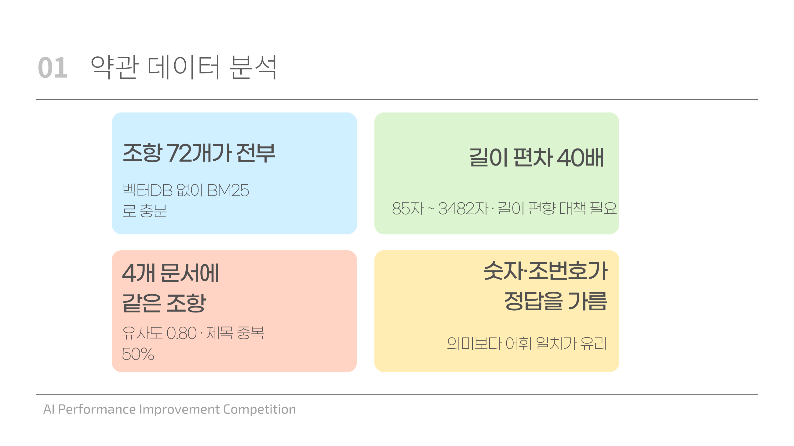
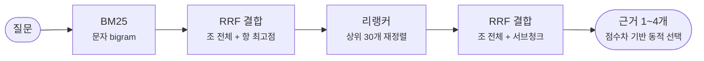
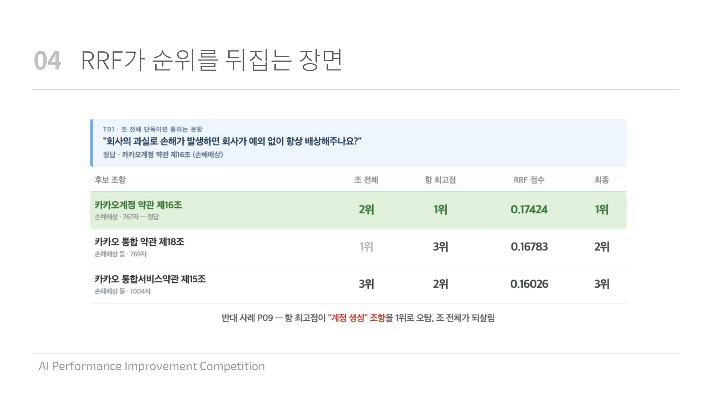
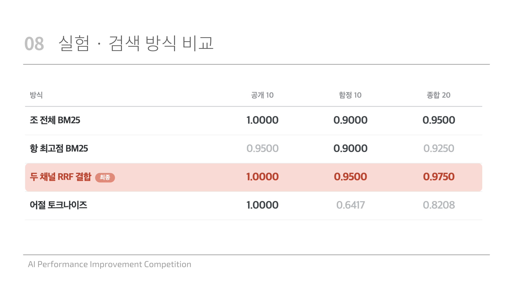
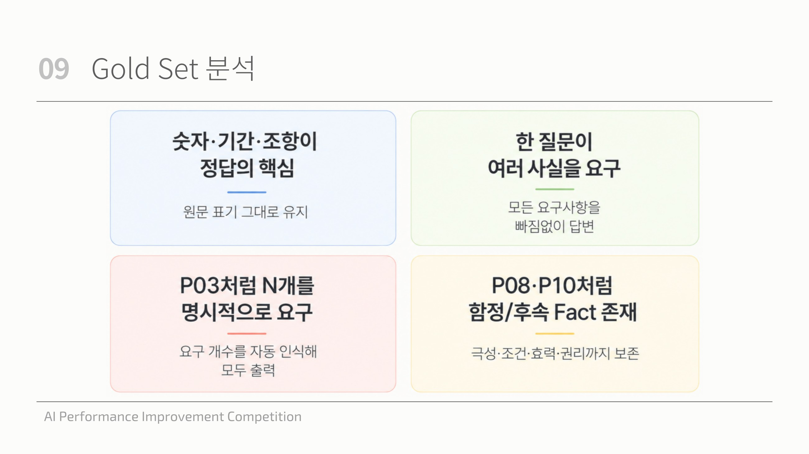

# 카카오 약관 RAG — 검색·생성 파이프라인 개선

카카오 약관 4종(조 단위 72개)에 대한 QA 파이프라인. 사내 AI 성능 개선 대회 출품작(Team 8).
**검색 MRR 1.000을 회귀 없이 유지하면서 생성 품질(키팩트 F1)을 0.6551 → 0.7514로 개선했다.**

| 축 | 배점 | 개선 전 | 최종 |
|---|---:|---:|---:|
| 검색 MRR | 20 | 1.000 | **1.000** (회귀 0) |
| 키팩트 F1 | 30 | 0.6551 | **0.7514** |
| 요청 성공률 | — | — | **36 / 36** (문항당 120초 제한, p95 51.9s) |

> 📄 실험 로그·기각 기록·버그 분석 전문은 **[프로젝트_상세.md](프로젝트_상세.md)** · 발표 원본은 **[발표 PDF](발표/AI_성능_개선_대회_8팀_발표자료.pdf)**

---

## 무엇을 판단했는가

**① 어디를 고칠지부터 쟀다.** 코드를 열기 전에 직전 공식 채점 결과를 축별로 분해했다.

| 축 | 점수 | 손실 | 비중 |
|---|---:|---:|---:|
| 검색 MRR | 20.00 / 20 | 0 | 0% |
| **키팩트 F1** | 19.65 / 30 | **−10.35** | **89%** |
| LLM 판정 | 48.73 / 50 | −1.27 | 11% |

손실의 89%가 한 칸에 몰려 있었다. 목표를 *"검색 만점을 회귀 없이 지키면서 F1만 올린다"* 로 좁혔고,
이건 **모델을 키우는 문제가 아니라 답변의 형태를 바꾸는 문제**라는 뜻이었다.
실제로 3B → 7B로 키운 쪽에서는 유의한 개선이 나오지 않았고, 형태를 바꾼 쪽에서 점수가 나왔다.

**② 데이터를 먼저 봤고, 그 관측이 설계를 결정했다.**

| 관측 | 설계 결정 |
|---|---|
| 코퍼스가 조 단위 **72개뿐** | 벡터DB·ANN 불필요. 전수 스코어링해도 밀리초 |
| 조 길이 **85 ~ 3482자 (40배)** | 길이 편향 대책이 검색·생성 **양쪽에서** 필수 |
| **정확 일치가 정답을 가름** ("2시간", "8세 이하", "제16조") | 임베딩보다 **어휘검색(BM25)이 유리** |
| 한국어 조사 부착 (`제10조는` vs `제10조`) | 형태소 분석기 대신 **문자 2-gram** (의존성 0) |
| 같은 제목 조항이 **72개 중 36개(50%)** 문서 간 중복 | 문서 특정 단서가 핵심 신호 → 없으면 원리적 한계 |



---

## 파이프라인



**반환 단위와 스코어링 단위를 분리했다.** 채점 형식이 `[문서명, 조번호]`라 반환·인용·생성 입력은 **조** 단위로 고정하고,
스코어링에만 **항** 단위 서브청크를 별도로 만들어 썼다. 검색 단위와 채점 단위가 어긋나면 내용을 맞혀도 점수가 안 나온다.

---

## 핵심 결정 세 가지

### 1. 실패 방향이 정반대인 두 채널을 RRF로 결합 — 같은 아이디어를 두 번 썼다

조 전체로 스코어링하면 **긴 조항이 짧은 조항을 압도**한다. 항 단위로 바꾸면 이번엔 **짧고 밀도 높은 항이 과대평가**된다.
두 실패가 정반대라서, 점수가 아닌 **순위**만 써서 섞었다 — `1/(10+조전체순위) + 1/(10+항최고순위)`

| BM25 스코어링 | 공개 10 | 함정 10 | 종합 20 | 1위 실패 문항 |
|---|---:|---:|---:|---|
| ① 조 전체만 | 1.0000 | 0.9000 | 0.9500 | T01, T09 |
| ② 항 최고점만 | 0.9500 | 0.9000 | 0.9250 | P09, T03, T04 |
| **③ RRF 결합** | **1.0000** | **0.9500** | **0.9750** | T09 |

②는 단독으로는 ①보다 나쁜데(0.9250 < 0.9500) 섞으면 ① 단독보다 좋아진다. **겹치는 실패가 하나도 없기 때문이다.**

RRF가 실제로 순위를 뒤집는 장면 — T01(*"회사의 과실이면 예외 없이 항상 배상하나요?"*)의 정답 조항은
조 전체 순위 2위·항 최고점 순위 1위였다. 둘 다 1위는 아니지만 **합치면 RRF 점수가 가장 높다.**



**같은 원리를 리랭커 단계에서 한 번 더 적용했다.**

| 리랭킹 방식 | 20문항 MRR | 실패 문항 |
|---|---:|---|
| 조 전체만 재채점 | 0.9750 | T01 |
| 서브청크만 재채점 | 0.9750 | T03 |
| **두 순위를 RRF 결합** | **1.0000** | **없음 — 20/20 1위** |

점수는 동률인데 실패 지점이 정반대였다. 후보를 두 번 가져오는 게 아니라 **같은 후보 30개를 두 관점으로 재채점**한다
(fetch 1회, 리랭커 추론만 2회).

토크나이저(A-2)부터 이 RRF 결합까지 전부 반영한 최종 비교표:



### 2. 벡터DB를 안 쓴 건 취향이 아니라 실측 결과다

| 방식 | 공개 10 | 함정 10 |
|---|---:|---:|
| **BM25 단독** | **1.00** | **0.95** |
| dense(임베딩) 단독 | 0.90 | 0.80 |
| BM25 + dense 3채널 RRF | **0.95 (하락)** | — |

dense를 3번째 채널로 넣으면 **이미 맞던 문항을 끌어내렸다.** 의미 판단은 2단 리랭커가 맡는다.
부수 효과로 **다운로드·로딩 실패 지점이 하나 줄었다** — "새 Colab에서 1회 실행, 실패하면 0점"인 환경에서 이게 컸다.

### 3. 채점식을 역산해 답변 형태를 재설계

관측된 버그를 프롬프트 규칙으로 막는 접근이 한계에 부딪혔다(P08 자기모순은 규칙을 세 번 고쳐도 재현).
방향을 바꿔 **채점지표에서 거꾸로 이상적인 답변 형태를 역산**했다.

먼저 골드셋 자체를 분석했다 — 정답을 가르는 게 무엇이고, 무엇을 요구하는 질문 유형인지.



공식 per-question 점수 10건을 후보식과 대조 → **답변 전체를 하나의 토큰 가방으로 보고 key_facts 전체와 F1** (MSE **0.0015**).
*"key_fact를 하나씩 채점한다"* 는 직관은 틀렸다(MSE 0.07~0.10).

여기서 나온 세 귀결이 이후 모든 결정의 기준이 됐다.

- **빠뜨려도 깎이고 덧붙여도 똑같이 깎인다** → 기존 검증은 recall만 봐서 문제의 절반만 보고 있었다
- **어미·조사가 다르면 다른 토큰이다** → 원문 표현을 유지하는 것이 곧 점수다
- **순서는 비용 0이다** → 판정어를 어디 두든 F1은 같다

세 번째가 **세 번 실패한 P08을 해결했다.** 판정어를 맨 앞에 강제하면 모델이 근거를 옮겨 적기 *전에* 결론을 확정해야 한다.
**F1 손해 0으로 "근거 먼저, 판정은 맨 끝"으로 바꿀 수 있었다.**

답변 스타일별 F1을 재보니 **봉우리가 좁았다.**

| 답변 스타일 (공개 10문항 평균) | F1 |
|---|---:|
| 결론만 | 0.586 |
| **정답 문장 통째 복사** | **0.776** |
| 조 전체 복사 | 0.525 |
| 절 greedy oracle (이론 상한) | 0.824 |

**덜 써도 급락하고 더 써도 급락한다.** 그래서 프롬프트를 두 축으로 짝지었다 —
*"원문 문장을 통째로, 그러나 질문 주제 밖으로는 넘어가지 말 것."* 한쪽만 지시하면 반대쪽으로 무너진다.

같은 이유로 근거를 **조 길이에 따라 다르게** 잘랐다. 짧은 조(123자)는 전문을 주면 F1 0.947인데,
긴 조(1391자)를 똑같이 주면 **0.160으로 붕괴**한다(약 6배).

---

## 어떻게 검증했는가

**평가셋을 직접 만들었다.** 공개 10문항은 전부 문서 특정 단서가 있고 난이도가 고른 편이라,
여기서 MRR 1.000이 나와도 **실력인지 과적합인지 구분이 안 된다.**

| 단계 | 규모 | 노린 것 |
|---|---:|---|
| 공개 문항 | 10 | 기준선 |
| 패러프레이즈 | +4 | 조사·어휘 변형 내성 |
| **자체 함정 T01~T10** | +10 | 원문의 예외조항·충돌 지점을 직접 찾아 출제 |
| **72개 조항 전수** | +72 | 문서명 힌트를 안 주는 최악 조건 |

**이 투자가 바로 값을 했다** — 토크나이저 실험에서 공개 10문항은 어절·bigram 둘 다 1.000이라 차이가 안 보였는데,
함정 10문항을 넣자 **0.6417 vs 0.9000**으로 갈렸다.

**과적합 감사를 따로 돌렸다.**

- 공개문항 텍스트·정답 **하드코딩 0건** (정적 감사)
- 평가셋에 없는 **held-out 60개 조항**에서 top-1 **90.0% vs 전체 90.3% — 격차 없음**
- 72개 조항 전수 **62/72 (86.1%)**, 실패 10건은 **전부 기존에 알던 한 패턴**, 새 실패 유형 0건

**나빠질 수 없는 재시도를 설계했다.** 답변에서 빠진 절을 리랭커로 지목해 1회 재생성하되,
**(a) 전부 근거에 grounded 이고 (b) 누락 절을 실제로 더 담았을 때만** 교체한다(monotonic gate).
→ 20문항 회귀에서 F1 **0.433 → 0.600, 개선 5건 · 퇴행 0건.**
전면 적용안은 **397문항 시뮬레이션에서 84건 악화**가 나와 미리 좁혔다.

**자기 주장을 통계로 철회했다.** 처음엔 *"7B로 올려서 좋아졌다"* 고 쓰려 했다.

| 10문항 대응표본 t검정 | 평균 차이 | 95% 신뢰구간 |
|---|---:|---|
| bigram F1 | +0.034 | **[−0.060, +0.129]** ← 0 포함 |
| 어절 F1 | +0.026 | **[−0.104, +0.155]** ← 0 포함 |

우위가 두 문항에 얹혀 있었고, 그 둘을 빼면 나머지 8문항은 3B가 앞섰다.
→ **"이득이 확인됐다"가 아니라 "손해 아님이 확인됐다"** 로 정정했다.
그래도 켜둔 이유는 리스크가 비대칭이기 때문이다 — 4bit 로딩이 실패하면 폴백이 곧 비교 대상인 3B다.

**되돌린 것도 기록했다** — few-shot(소계 37.90 → 36.44), 규칙 프롬프트 강화(변화 0),
검색 회수 확대(답변 10개 중 9개가 글자까지 동일). 전부 *"좋아 보였는데 숫자가 아니었다."*

---

## 운영 안정성

배점은 없지만 **문항당 120초를 넘으면 0점**이라 속도를 목적함수가 아닌 **제약조건**으로 뒀다
(p50 22s / p95 51.9s = 제한의 43%). 남은 여유는 전부 품질로 환전했고, 실패 지점마다 폴백을 뒀다.

| 실패 지점 | 폴백 |
|---|---|
| 리랭커 로딩 실패 | BM25 RRF 단독 경로로 자동 전환 |
| 7B 4bit 로딩 실패 | 3B fp16 자동 폴백 |
| torch 재설치 위험 | `--no-deps` 설치로 **재설치(=0점) 원천 차단** |
| 원문 다운로드 실패 | 원문을 문자열 리터럴로 내장 — 다운로드 자체를 제거 |

로딩 분기 5~6갈래(GPU 유/무 × bnb 정상/없음/실패 × 4bit OOM)를 가짜 로더로 전부 실행해 라우팅을 검증했다.

---

## 알고 있는 한계

- **리랭커 `max_length`가 코드엔 512로 남아 있다** — 설계 판단은 2048. 72개 중 8개(11%)가 여기 걸린다. 한 줄 수정
- **P02 퇴행** — 오프라인 예측 0.610, 실측 0.435. 검색은 정상이라 순수 생성 문제인데 원인 후보 셋을 아직 못 가렸다
- **원리적 한계** — 4개 문서의 제3조가 전부 "약관 외 준칙"(유사도 0.80). 질문에 문서 단서가 없으면 판단 불가능
- **생성 쪽 과적합 위험 중간** — 답변 형태를 공개 gold에서 역산해 고정했고 일부 상수가 n=2~3 거동으로 확정됐다

남은 헤드룸도 크기까지 재 뒀다 — 세 문항 처방 **+2.8점**, 임계값 조정 **+1.65점**.

---

## 기술 스택

| 구성 | 선택 |
|---|---|
| 검색 | `rank_bm25` (BM25Okapi) + 문자 2-gram 토크나이즈 |
| 리랭커 | `BAAI/bge-reranker-v2-m3` (sentence-transformers `CrossEncoder`), BM25 top-30 재정렬 |
| 융합 | RRF `1/(k+rank)`, k=10 — BM25 단계 + 리랭커 단계 **2회** |
| 생성 | `Qwen/Qwen2.5-7B-Instruct` NF4 4bit → 폴백 `Qwen2.5-3B-Instruct` fp16<br/>T4 15GB에 ~7GB 적재, `compute_dtype=fp16` (**T4 sm_75에는 bf16 텐서코어 없음**) |
| 서빙 | FastAPI · 문항당 120초 타임아웃 · 동시성 2 |
| 평가기 | Gemini 3.5 Flash (`temperature=0`) + 규칙 기반 문항 단위 폴백 |

## 저장소

```
├── 결과기_최종.ipynb        # 제출물 — 새 Colab에서 위→아래 1회 실행
├── 평가기/                  # 교차평가 채점기 (별도 제출물) · 로컬 검증 88건
├── 하네스/                  # 검색·생성 실험 하네스, 자체 함정 문항 T01~T10
│   └── 오프라인실험/         # bm25_ablation · style_sim · structural_sweep · make_evalset
├── 약관원문_확정/            # 파싱된 원문 (조 단위 72개)
├── 프로젝트_상세.md          # 실험 로그·기각 기록·버그 분석 전문
└── 리트리버_설계노트.md      # 설계 기록 §1~15
```

```bash
python3 하네스/오프라인실험/bm25_ablation.py    # 검색 방식 5종 비교 (GPU 불필요)
```

---

> **측정이 먼저였고, 코드가 그다음이었다.**
>
> 어디를 고칠지부터 쟀고 · 공개 문항에서 안 보이던 차이를 드러낼 평가셋을 직접 만들었고 ·
> 한 아이디어(실패 방향이 반대인 채널 결합)를 두 단계에서 재사용했고 ·
> 숫자가 아니었던 것은 되돌렸고 · 내 주장 하나는 통계로 철회했다.
