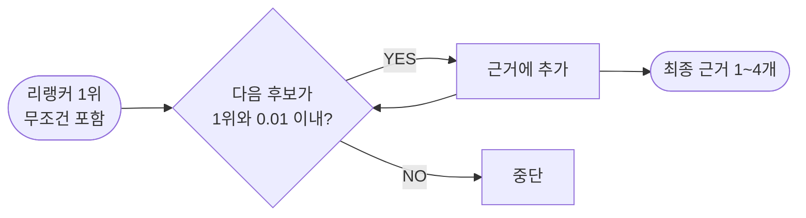
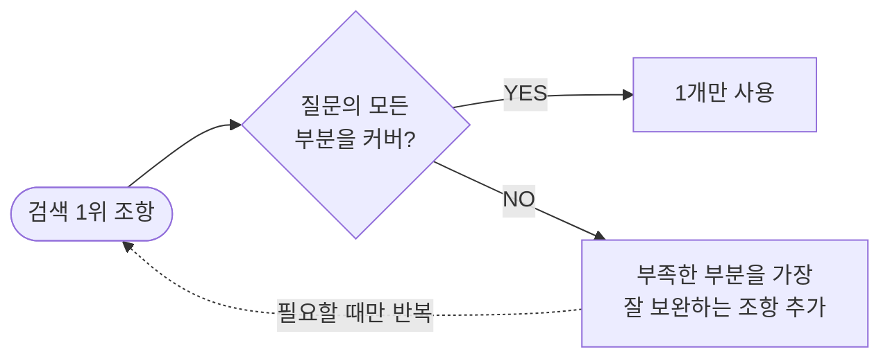
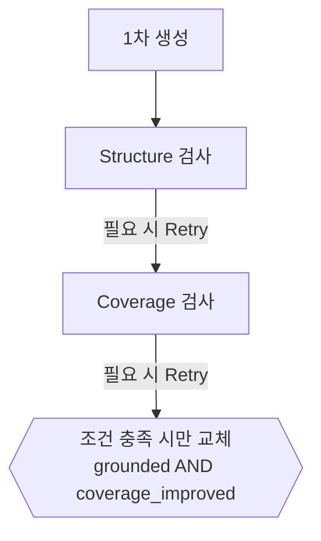

# 카카오 약관 RAG — 검색·생성 파이프라인 개선

> **AI 성능 개선 대회 · Team 8** — 카카오 약관 4종(72개 조항)에 대한 QA 파이프라인을
> 검색과 생성으로 분리해 각각 측정하고 개선한 기록.
>
> 검색 **MRR 1.000을 회귀 없이 유지**하면서 생성 쪽 **키팩트 F1을 0.6551 → 0.7514**로 올렸다.

---

## 한눈에 보기

| 축 | 배점 | 개선 전 | 최종 |
|---|---:|---:|---:|
| 검색 MRR | 20 | 1.000 | **1.000** (회귀 0) |
| 키팩트 F1 | 30 | 0.6551 | **0.7514** |
| LLM 판정 | 50 | 48.73 | — (본선 채점 대기) |
| HTTP 요청 성공 | — | — | **36 / 36** (타임아웃 0) |

**설계를 관통하는 아이디어 하나**

> **실패 방향이 정반대인 두 채널을 순위(rank) 레벨에서 RRF로 섞는다.**
> BM25 단계와 리랭커 단계에서 **같은 원리를 두 번** 썼고, 두 번 다 단독 채널보다 좋아졌다.
> 두 번째 적용에서 20문항 전부 1위(MRR 1.000)가 나왔다.

---

## 1. 문제 정의

카카오 약관 4종에 대해 질문을 받아 **① 근거 조항을 검색하고 ② 답변을 생성**하는 시스템.

```
총점 = 0.20 × (검색 MRR × 100)
     + 0.30 × (키팩트 F1 × 100)
     + 0.50 × (LLM 판정 0~100)      판정 = 정확성·근거성·완결성·명료성 4축
```

운영 제약이 설계를 크게 규정했다.

- **새 Colab 세션에서 위→아래로 한 번에 실행**, 중간에 실패하면 **0점**
- **문항당 120초 타임아웃** — 넘으면 0점
- 속도 자체에는 배점이 없음 (공식 결과 파일에서 `"performance": {"status": "disabled"}` 확인)

### 어디를 고칠지부터 정했다

작업의 출발점은 코드가 아니라 **직전 공식 채점 결과를 분해하는 것**이었다.

| 축 | 배점 | 점수 | 손실 | 손실 비중 |
|---|---:|---:|---:|---:|
| 검색 MRR | 20 | 20.00 | 0 | 0% |
| **키팩트 F1** | 30 | 19.65 | **−10.35** | **89%** |
| LLM 판정 | 50 | 48.73 | −1.27 | 11% |
| **총점** | 100 | **88.378** | −11.62 | |

**손실의 89%가 키팩트 F1 한 칸**에 몰려 있었다. 그래서 목표를 좁혔다 —
*"검색 MRR 1.000을 회귀 없이 지키면서, 생성 쪽 F1만 올린다."*

이건 모델을 키우는 문제가 아니라 **답변의 형태를 바꾸는 문제**였다.
실제로 3B → 7B로 키워봤지만 통계적으로 유의한 개선이 나오지 않았고([E-2](#e-2-7b가-더-좋다는-주장을-철회했다)),
형태를 바꾼 쪽에서 점수가 나왔다.

---

## 2. 데이터 분석이 설계를 결정했다

코드를 짜기 전에 원문 4종을 파싱해 특성부터 봤다. **여기서 나온 관측이 이후 설계를 거의 다 결정했다.**

| 관측값 | 여기서 나온 설계 결정 |
|---|---|
| **코퍼스가 조 단위 72개뿐** | 벡터DB·ANN 불필요. 전수 스코어링해도 밀리초. **BM25만으로 충분한 규모** |
| **조 길이 85자 ~ 3482자 — 40배 불균일** | 균일 청킹 불가. **길이 편향 대책이 검색·생성 양쪽에서 필수** |
| **보일러플레이트가 문서 간 중복** — "약관 외 준칙"은 4개 문서 전부에 유사도 0.80, 제목 중복 조항이 72개 중 36개(50%) | 문서를 특정하는 단서가 검색의 핵심 신호. 단서가 없으면 **원리적 한계** |
| **정확 일치가 정답을 가른다** — "2시간", "8세 이하", "제16조", "6개월" | 의미검색(임베딩)보다 **어휘검색(BM25)이 유리** — 실측으로 확인 |
| **한국어는 조사가 붙는다** — `제10조는` vs `제10조` | 형태소 분석기 대신 **문자 2-gram 토크나이즈** |

파싱 결과 조(條) 단위 **72개** — 카카오계정 17 / 위치정보 16 / 통합서비스 18 / 통합 21.

---

## 3. 평가셋을 먼저 만들었다

공개 10문항은 (a) 전부 문서를 특정할 고유 단서가 있고 (b) 난이도가 고른 편이라,
**여기서 MRR 1.000이 나와도 실력인지 과적합인지 구분이 안 된다.**

| 단계 | 무엇 | 규모 | 노린 것 |
|---|---|---:|---|
| 1 | 공개 10문항 | 10 | 기준선 |
| 2 | 패러프레이즈 | +4 | 조사·어휘 변형 내성 |
| 3 | **자체 함정 T01~T10** | +10 | 원문의 예외조항·충돌 지점을 직접 찾아 출제 |
| 4 | **72개 조항 전수** | +72 | **문서명 힌트를 안 주는 최악 조건** |
| 별도 | 합성 평가셋 v3 | 397 | 방식 간 상대 비교용 대량 표본 |

**함정 문항 예시 (T01)**

> *"회사의 과실로 손해가 발생하면 회사가 예외 없이 항상 배상해주나요?"*
> **정답** · 카카오계정 약관 제16조 |
> **함정** · 손해배상 조항이 3개 문서에 거의 동일하게 중복(767 / 769 / 1004자)

이 투자가 바로 값을 했다. 아래 [토크나이저 실험](#a-2-토크나이저--어절--문자-2-gram)에서
어절 방식과 bigram 방식이 **공개 10문항에서는 둘 다 1.000이라 차이가 안 보였는데**,
함정 10문항을 넣자 0.6417 vs 0.9000으로 갈렸다.

> ⚠️ **평가셋의 한계도 명시해 둔다** — 합성 문항은 정답 key_fact를 원문 문장에서 떼어 만들었기 때문에
> F1 실험에 쓰면 "정답 문장 복사"가 자동 만점이 된다. 그래서 **합성셋은 검색 실험에만 쓰고,
> F1 계열 실험은 전부 공개 10문항으로만** 했다.

---

# PART A · 검색

## 최종 파이프라인


---

## A-1. 청킹 — 두 단위를 분리했다

채점 형식이 `[문서명, 조번호]` 라서 **청킹 단위를 조에 정확히 일치**시켰다.
검색 단위와 채점 단위가 어긋나면 **내용을 맞혀도 점수가 안 나오기 때문**이다.

| | 조(條) 단위 · 72개 | 항(項) 단위 서브청크 |
|---|---|---|
| 쓰는 곳 | 채점 단위와 일치 · 최종 반환 · 인용 · **생성 모델에 넘기는 원문** | **BM25·리랭커 스코어링 전용** |
| 반환 | O | **X (반환하지 않음)** |

즉 **"반환·인용 단위 = 조" / "스코어링 단위 = 조 + 항"** 으로 분리했다.

<details>
<summary>표준 부모-자식 청킹과 뭐가 다른가</summary>

| | 표준 부모-자식 | 이 프로젝트 |
|---|---|---|
| 순위 기준 | 자식 점수만 | **자식 + 부모 점수를 RRF로 결합** |
| LLM에 주는 것 | 부모 전체 | 부모 전체 (동일) |
| 전제하는 검색 | 보통 임베딩(의미) | BM25(어휘) |

표준이 "자식 단독"으로 충분한 이유는 임베딩이라 짧아도 의미를 이해하기 때문이다.
여기는 어휘 기반이라 **짧은 항일수록 우연한 단어 밀도에 낚인다** — 아래 A-3의 실측(② 0.9250)이 그 증거다.
</details>

## A-2. 토크나이저 — 어절 → 문자 2-gram

| | 기존 · 어절 토큰 | 최종 · 문자 2-gram |
|---|---|---|
| 질문 `제10조는` | `['제10조는']` | `제1 · 10 · 0조 · 조는` |
| 원문 `제10조` | `['제10조']` | `제1 · 10 · 0조` |
| 결과 | **겹침 0 → 점수 0** | **3/4 토큰이 그대로 겹침** |

조사 하나에 완전히 다른 토큰이 되는 문제를, **형태소 분석기 없이** 흡수했다.
추가 의존성 0 · 설치 실패 위험 0 — "실패하면 0점"인 실행 환경에서 이게 중요했다.

**실측** — T10 *"카카오 통합서비스약관에 따르면…"* → 어절 **6위** / bigram **1위**

| 토크나이즈 | 공개 10 | 함정 10 | 종합 20 |
|---|---:|---:|---:|
| 어절 | 1.0000 | **0.6417** | 0.8208 |
| **문자 bigram** | 1.0000 | **0.9000** | **0.9500** |

## A-3. BM25 — 단일 채널 → 2채널 RRF

### 문제 — 긴 조항이 짧은 조항을 압도한다

조 전체를 하나로 스코어링하면, **긴 조항일수록 흔한 단어가 우연히 많이 포함**된다.
BM25의 길이 정규화로도 40배 길이 차이는 상쇄되지 않는다.

### 대안을 시험했더니 이번엔 반대 편향이 생겼다

"항 단위로 쪼개 그 조의 최고점을 대표 점수로 쓰는" 방식 →
**문맥과 무관하게 짧고 밀도 높은 항이 과대평가**되는 **새로운** 실패가 생겼다.

### 결합 — 실패 유형이 정반대라서 섞으면 메워진다

점수가 아닌 **순위만** 써서 스케일 문제를 없앴다.

```
RRF score = 1 / (10 + 조_전체_순위) + 1 / (10 + 항_최고점_순위)
```

| 스코어링 방식 | 공개 10 | 함정 10 | 종합 20 | 1위 실패 문항 |
|---|---:|---:|---:|---|
| ① 조 전체만 | 1.0000 | 0.9000 | 0.9500 | T01, T09 |
| ② 항 최고점만 | 0.9500 | 0.9000 | 0.9250 | P09, T03, T04 |
| **③ ①+② RRF 결합** | **1.0000** | **0.9500** | **0.9750** | T09 |

**②는 단독으로 쓰면 ①보다 나쁜데(0.9250 < 0.9500), ①과 섞으면 ① 단독보다 좋아진다.**
실패 문항 목록을 보면 이유가 보인다 — **겹치는 실패가 하나도 없다.**

### RRF가 순위를 뒤집는 실제 장면 (T01)

| 후보 조항 | 조 전체 | 항 최고점 | RRF 점수 | 최종 |
|---|---:|---:|---:|---:|
| **카카오계정 약관 제16조** · 767자 — **정답** | 2위 | 1위 | **0.17424** | **1위** |
| 카카오 통합 약관 제18조 · 769자 | 1위 | 3위 | 0.16783 | 2위 |
| 카카오 통합서비스약관 제15조 · 1004자 | 3위 | 2위 | 0.16026 | 3위 |

반대 사례도 있다 — **P09**에서는 항 최고점이 "계정 생성" 조항을 1위로 오탐했고, **조 전체 채널이 되살렸다.**
두 채널이 서로를 메운다는 게 양방향으로 확인된다.

## A-4. 리랭커 — 같은 원리를 한 번 더

BM25로 상위 30개를 뽑고 `BAAI/bge-reranker-v2-m3`로 정밀 재정렬한다.
그리고 **A-3과 똑같은 2채널 RRF를 리랭커 단계에서 한 번 더** 적용했다.

| 리랭킹 방식 | 20문항 MRR | 실패 문항 |
|---|---:|---|
| 조 전체만 재채점 | 0.9750 | **T01** |
| 서브청크만 재채점 | 0.9750 | **T03** |
| **두 순위를 RRF 결합** | **1.0000** | **없음 — 20/20 1위** |

**점수는 동률인데 실패 지점이 정반대**였다. 섞으니 T01·T03·T09가 전부 해결됐다.

> **오해 하나** — 후보를 두 번 가져오는 게 아니다.
> BM25로 뽑은 **같은 후보 30개**를 두 관점(조 전체 / 질문에 가장 맞는 항 1개)으로 재채점한 뒤 결합한다.
> → **fetch 1회, 리랭커 추론만 2회.**

> **pool=30이 충분한가?** 리랭커가 정답을 되찾아준 사례들의 BM25 원시 순위를 전부 확인한 결과
> **전부 5위 이내**였다(30위 밖 사례 0건). 72개 코퍼스에서 30은 넉넉하다.

## A-5. 근거 개수 동적 결정

반환 계약이 **"실제 사용한 근거만 1~4개"** 라서 top-4 고정이 아니라 점수 기반 동적 선택이 필요했다.



**비율 컷오프는 세 번 실패했다.**

| 시도 | 결과 |
|---|---|
| 절대 임계값 `rel_threshold=0.3` | **한 번도 걸러낸 적 없는 죽은 파라미터** — 10문항 전부 항상 4개 반환 |
| 상대 비율 `rel_gap_ratio=0.7` | 여전히 10문항 전부 4개 |
| **절대 점수차 `margin=0.01`** | **채택** — 실전에서 "항상 4개" → "1~3개 가변"으로 바뀜 |

원인은 **RRF 점수가 1.0 근처에 압축**된다는 것이었다. 비율 컷오프는 **0.986도 통과**시켜 무력해진다.

## A-6. 검색 최종 결과

| 검증 | 규모 | 결과 |
|---|---:|---|
| 공개 10문항 (공식 채점) | 10 | **MRR 1.000** — 10/10 1위 |
| 공개 + 함정 (리랭커 2채널 RRF) | 20 | **MRR 1.000** — 20/20 1위 |
| 함정 10 (리랭커 없는 폴백 경로) | 10 | MRR 0.950 |
| 합성 397문항 (폴백 경로) | 397 | **Recall@4 = 1.00**, 실패 0건 |
| **72개 조항 전수 (문서명 힌트 없음)** | 72 | **62/72 (86.1%) 1위 적중** |

전수에서 실패한 10건은 전부 개별로 열어봤다 —
**100%가 이미 알고 있던 보일러플레이트 충돌 한 패턴이었고, 새로운 실패 유형은 0건**이었다.

### 과적합 감사

1. **정적 감사** — 공개문항 텍스트·정답 **하드코딩 0건**. 문항 ID는 전부 주석·docstring 안에만 존재
2. **held-out 테스트** — 평가셋에 없는 **60개 조항**으로 일반화 테스트 →
   top-1 **90.0%(held-out) vs 90.3%(전체)**. **격차 없음 = 평가셋 편애 없음**
3. **행동 근거** — few-shot을 "일반화가 깨진다"는 이유로 **실제로 되돌린 기록**이 있음

## A-7. 기각한 것 — 왜 안 했는지에도 근거가 있다

| 시도 | 실측 결과 | 판단 |
|---|---|---|
| **dense(임베딩) 검색 추가** | 단독 0.90 / 0.80 (BM25는 1.00 / 0.95). 3번째 채널로 넣으면 공개 10문항이 1.00 → **0.95로 악화** | 기각 |
| **전수 리랭킹** (BM25 생략) | CPU 기준 질문당 **24.45초** | 검토 중단 |
| **`•` 글머리기호 추가 분할** | MRR 0.9457 → **0.9239 악화** | 기각 |
| **서브청크 점수 단독 사용** | 정답 vs 보일러플레이트 격차가 0.97 → **0.15로 84% 붕괴** | 금지. 결합만 허용 |
| **RRF k·집계방식 스윕** | 기존값(`max`, k 무관)이 최선 | 유지 (바꿀 근거 없음) |

<details>
<summary>도중에 잡은 검색 버그 4개 — 성능 향상의 상당 부분은 새 기능이 아니라 버그 수정이었다</summary>

1. **인덱스에 문서명이 아예 없었다** — `_CORPUS_TEXT`를 `f"{title} {text}"`로만 만들어,
   질문이 문서를 명시적으로 지목해도 그 신호가 **완전히 무시**됐다. → `f"{doc} {title} {text}"`로 수정, 즉시 1위 정정
2. **서브청크 분할 정규식** — 순수 lookahead(`(?=\d+\.[^\d])`)라 `re.split`이 **"10." 이상 번호를 "1"과 "0.내용"으로 재분할**.
   5자 미만 파편 21개 → `(?<!\d)` 추가로 **파편 0개**
3. **리랭커 입력 truncation** — `[:1000]` + `max_length=512`로 이중 절단.
   72개 중 8개(11%)가 512토큰 초과였고, 최악은 **2482자가 통째로 소실**.
   같은 조항·같은 질문에서 리랭커 점수 **0.03 vs 0.85 — 31배 차이**를 실증
4. **이중 sigmoid** — `CrossEncoder.predict()`가 이미 0~1을 반환하는데 그 위에 `_sigmoid()`를 한 번 더 씌워
   모든 점수를 **0.70~0.73으로 압축**. 제거 후 격차 복원 (정답 1.000 vs 유사 오답 0.986)
</details>

---

# PART B · 생성

## B-1. 채점식을 역산했다 — 이게 전환점이었다

처음엔 관측된 버그를 프롬프트 규칙으로 하나씩 막았다. **한계에 부딪혔다** —
P08의 자기모순 버그(근거를 정확히 인용해놓고 바로 다음 문장에서 반대 결론)는
규칙 문구를 세 가지 방식으로 고쳐도 **세 번 모두 그대로 재현**됐다.

그래서 방향을 바꿨다. *"관측된 버그를 규칙으로 막는다"* → ***"채점지표에서 거꾸로 이상적인 답변 형태를 역산한다."***

공식 per-question 점수 10건을 여러 후보식과 대조했다.

| 후보식 | 공식 점수와의 MSE |
|---|---:|
| **답변 전체 vs key_facts 이어붙인 문자열, 어절 집합(set) F1** | **0.0015** ✅ |
| 같은 방식, multiset F1 | 0.0022 |
| 문자 bigram F1 | 0.0038 |
| key_fact별 F1의 평균 | 0.07~0.10 (불일치) |

> **결론: 답변 전체를 하나의 토큰 가방(bag-of-tokens)으로 보고 key_facts 전체와 F1을 잰다.**
> 마지막 행이 중요하다 — *"key_fact 하나하나를 따로 채점한다"* 는 직관은 **틀렸다.**

**여기서 나온 3가지 귀결이 이후 모든 결정의 기준이 됐다.**

1. **빠뜨려도 깎이고, 덧붙여도 똑같이 깎인다** → 기존 검증 셀은 recall만 봐서 **문제의 절반만** 보고 있었다
2. **어미·조사가 다르면 다른 토큰이다** — `금지되어 있으며` vs `금지됩니다` = 양쪽에서 1토큰씩 손해
   → **원문 표현을 그대로 유지하는 것이 곧 점수다**
3. **순서는 비용 0이다** → 판정어("네/아니오")를 어디에 두든 F1은 같다

3번이 **세 번 실패한 P08을 해결했다.** 판정어를 맨 앞에 강제하면 모델이 근거를 옮겨 적기 *전에*
결론을 확정해야 한다. **F1 손해 0으로 "근거 먼저, 판정은 맨 끝"으로 바꿀 수 있었다.**

## B-2. Gold Set 분석 — 정답의 단위는 "조"도 "항"도 아니고 "문장"이다

| 관측 | 대응 |
|---|---|
| **숫자·기간·조항이 정답의 핵심** | 원문 표기 그대로 유지 |
| **한 질문이 여러 사실을 요구** | 모든 요구사항을 빠짐없이 답변 |
| **P03처럼 N개를 명시적으로 요구** | 요구 개수를 자동 인식해 모두 출력 |
| **P08·P10처럼 함정/후속 Fact 존재** | 극성·조건·효력·권리까지 보존 |

골드셋 key_facts를 원문과 1:1 대조하니, **key_facts는 정답을 담은 원문 문장 하나를 의미 단위로 쪼갠 것**이었다.
서로 다른 규칙으로 대응하던 P02·P04 감점이 실은 **같은 원인 하나**였다 —
**정답 문장을 통째로 옮기지 않고 뒷부분만 잘라 썼다.**

## B-3. 답변 스타일 실험 — 봉우리가 좁다

같은 문항에 **답변 형태만 바꿔가며** F1을 쟀다.
(공식 토크나이저가 비공개라 조사 제거 어절 / 문자 bigram **두 근사로 교차 확인** — 순위가 일치해 결론이 토크나이저 선택에 둔감함을 확인)

| 답변 스타일 (공개 10문항 평균) | 평균 F1 |
|---|---:|
| 결론만 | 0.586 |
| 질문 되풀이 + 결론 | 0.571 |
| **정답 문장 통째 복사** | **0.776** |
| 정답 항 전체 복사 | 0.687 |
| **조 전체 복사** | **0.525** |
| 절 greedy oracle (이론 상한) | 0.824 |
| ★ 실제 제출 답변 | 0.751 |

> **덜 써도 급락하고(0.586), 더 써도 급락한다(0.525). 봉우리가 좁다.**

그래서 프롬프트를 **두 축으로 짝지어** 설계했다 —
**"원문 문장을 통째로, 그러나 질문 주제 밖으로는 넘어가지 말 것."**
어느 한쪽만 지시하면 반대쪽으로 무너진다.

## B-4. Key Fact 보존 프롬프트

**일반 QA 프롬프트가 F1에 정면으로 해로운 두 가지 행동을 한다.**

| 문제 | 결과 |
|---|---|
| 너무 짧게 요약하면서 **조건·효력·후속 내용을 삭제** | recall 손실 |
| 원문을 자연스럽게 바꾸면서 **평가에 필요한 핵심 표현이 변형** | 토큰 불일치로 양쪽 손실 |

→ **일반 QA 프롬프트 → 원문 보존 프롬프트**로 전환.

프롬프트만 믿지 않고 후처리 정규식(`_postprocess_answer`)도 뒀는데,
여기서도 **개별 연결어를 나열하는 대신 "근거지시명사(조/항/규정/조항/약관/조문) + 조사"라는 문법 구조 자체**를 포착하도록 일반화했다.
→ **테스트에 한 번도 안 넣은 신규 변형 5종**까지 전부 커버되는 것을 확인.

## B-5. Structural Evidence — 조 길이에 따라 다르게 자른다

데이터 특성 2(길이 40배 차이)가 **생성에서도 그대로** 문제였다.

| 문항 | 조 길이 | 조 전체를 그대로 답변으로 썼을 때 F1 |
|---|---:|---:|
| P08 | **123자** | **0.947** |
| P05 | 105자 | 0.913 |
| P10 | 494자 | 0.590 |
| P02 | 682자 | 0.245 |
| **P09** | **1391자** | **0.160** |

> **짧은 조(105~123자)는 전문을 그대로 주면 0.91~0.95가 나오는데,
> 긴 조(1391자)를 똑같이 주면 0.160으로 붕괴한다. 약 6배 차이다.**

또 하나 — 문장 유사도만 쓰면 `① 조건 / ② 조건의 효력 / ③ 권리` 중
**①+③만 선택되고 ②가 빠지는** 문제가 있었다. 그래서 구조를 보존하는 쪽으로 갔다.

| 근거 길이 | 처리 |
|---|---|
| 짧은 조항 | **전체 원문** 그대로 |
| 긴 조항 | **관련 항/호 블록 단위로 보존** (문장 단위로 잘게 쪼개지 않음) |
| 필요 시 | **앞뒤 연결 항까지 포함** |

## B-6. Dynamic Context Coverage + Selective Retry — 가장 크게 올린 장치

### 진단 — 손실이 두 방향이었다

공식 결과를 문항별로 P(정밀도)/R(리콜) 분해했다.

| 문항 | F1 | P | R | 원인 | 방향 |
|---|---:|---:|---:|---|---|
| P07 | 0.333 | 0.44 | **0.21** | key_fact 3개 중 2개 누락 | **덜 씀** |
| P02 | 0.450 | 0.39 | 0.39 | **한 문장의 앞 절** 통째 누락 | **덜 씀** |
| P08 | 0.452 | 0.80 | **0.27** | 조가 2문장뿐인데 앞 문장 통째 누락 | **덜 씀** |
| P09 | 0.468 | **0.37** | 0.65 | **안 물어본** 열거를 끌어옴 | **더 씀** |
| P10 | 0.746 | **0.56** | 0.82 | 질문 되풀이·중복 서술 | **더 씀** |

**리콜 손실 3건 + 정밀도 손실 2건 — 두 방향 모두 고쳐야 했다.**

### Dynamic Context Coverage — 근거를 몇 개 넘길지 질문이 정한다



### Selective Retry — 나빠질 수 없는 재시도



핵심은 **채택 게이트**다. 재생성 답변이
**(a) 전부 근거에 grounded 이고 (b) 누락 절을 실제로 더 담았을 때만** 채택한다.
→ **구조적으로 나빠질 수 없다 (monotonic).**

정답이나 의미를 하드코딩하지 않는다 — 근거를 **절(節) 단위**로 쪼개고
각 절의 질문 관련도를 **리랭커로 채점**해 "관련도는 높은데 답변에 거의 안 담긴 절"을 지목한다.

### 결과

| 검증 | 결과 |
|---|---|
| **20문항 회귀** (공개10+함정10), 엄격 F1 | **0.433 → 0.600** · 개선 5 · **퇴행 0** · 채택 8/20 · 지연 p50 12.2s |
| 개선된 5건 | P09, P10, **T03 · T05 · T08 (3건이 함정 문항)** |
| 오프라인 재검증 (어절 F1) | 평균 **0.623 → 0.715** |

### 가장 중요한 발견 — 우려가 정반대로 나왔다

가장 걱정한 시나리오는 *"커버리지가 예외 조항을 억지로 끌어와 함정 결론을 흐린다"* 였다.
실제로는 **정반대**였다.

> 함정 문항은 **"원칙 + 예외"를 둘 다 말해야 정답**인데,
> 모델이 빠뜨리던 예외를 **커버리지가 정확히 보완**했다. 개선 5건 중 3건이 함정 문항이다.

### 위험은 넣기 전에 확인했다

문턱 없이 전면 적용하는 안을 **397문항 시뮬레이션으로 먼저 검증** →
**86문항 발동, 84건 악화(평균 −0.089).** 위험이 명확히 확인됐다.
→ 200자 상한으로 좁히자 **발동 0건**, 실제 답변으로는 **P08만 0.400 → 0.935, 나머지 9문항 불변.**

**넣지 않기로 한 것도 있다** — precision 가드다.
채택 8건 중 4건이 길이 폭증으로 악화했지만, T05는 10배 늘고도 최대 개선(+0.559)이라 **길이만으로는 가를 수 없었다.**
precision 저하는 gold 대조 없이는 추론 시점에 알 수 없어서, **근거 없는 가드를 넣는 대신 의도적으로 보류**했다.

## B-7. 생성 최종 결과

| | 개선 전 | 최종 |
|---|---:|---:|
| 평균 키팩트 F1 | 0.6551 | **0.7514** |
| P08 | 0.45 | **0.93** |
| P07 | 0.33 | **0.61** |
| 검색 MRR | 1.000 | **1.000 (회귀 없음)** |

> **자체 근사의 신뢰도를 두 번 검증했다** — 공식 per-question과 후보식 대조 **MSE 0.0015**,
> 외부 답변 세트로 재검증 시 **평균 절대오차 0.0228 · 편차 +0.0152**(약간 낙관적).
> **정직하게 말하면 0.7514는 공식 기준으로 약 0.736으로 봐야 한다.**

---

# PART C · 품질과 속도

**속도는 목적함수가 아니라 제약조건**으로 뒀다. 배점은 없지만 **문항당 120초를 넘으면 0점**이기 때문이다.

| 항목 | 값 |
|---|---|
| 성공 | **36 / 36** (12요청 × 3회 반복, 타임아웃 0) |
| p50 | 22 s |
| **p95** | **51.92 s** — 120초 제한의 **43%**, **2.3배 여유** |
| 3회 반복 p50 편차 | 0.39 s |

**남은 여유는 전부 품질로 환전했다.**

| 결정 | 속도 비용 | 얻은 것 |
|---|---|---|
| 근거 truncation 전면 제거 | **오히려 빨라짐** (9.91s → 7.47s) | 최악의 조항에서 **2482자 소실** 문제 해결 |
| 3B → 7B 4bit | +1.6 s | 이득 미증명, **손해 아님** |
| `max_new_tokens` 320 → 2200 | 생성 시간 증가 | 나열형 질문에서 정의까지 서술 가능 |
| `RETRY_DEADLINE_S` 45 → 35 s | 재시도 일부 생략 | **덜 다듬어진 답변이 타임아웃 0점보다 낫다** |

### 실패해도 0점이 되지 않게 — 폴백을 전 구간에 뒀다

| 실패 지점 | 폴백 |
|---|---|
| 리랭커 다운로드/로딩 실패 | BM25 RRF 단독 경로로 자동 전환 |
| 7B 4bit 로딩 실패 | **3B fp16 자동 폴백** |
| `bitsandbytes` 설치 실패 | `_HAS_BNB=False`로 넘어가 셀이 죽지 않음 |
| torch 재설치 위험 | `--no-deps` 설치로 **torch 재설치(=0점) 원천 차단** |
| 원문 다운로드 실패 | 원문을 **문자열 리터럴로 내장** — 다운로드 자체를 없앰 |

**로딩 분기 5~6갈래**(GPU 유/무 × bnb 정상/없음/실패 × 4bit OOM)를 가짜 로더로 전부 실행해
의도한 모델로 라우팅되는지 검증했다(전체 PASS).

---

# PART D · 알고 있는 한계

### E-1. 되돌린 것 — 전부 "좋아 보였는데 숫자가 아니었다"

| 시도 | 실측 결과 | 조치 |
|---|---|---|
| few-shot 예시 추가 | P08 못 고침 **+ P09에 새 회귀**. 소계 37.90 → **36.44** | **되돌림** |
| 규칙 프롬프트 강화 | P03·P09·P10 **셋 다 변화 없음** | 원복 |
| 검색 회수 확대 | 답변 10개 중 **9개가 글자까지 동일** | 되돌림 |

> 규칙 강화 실험의 **진단이 결정적이었다** — `prepared_ctx`를 찍어보니 **누락 문장 3개가 전부 프롬프트에 있었다.**
> **100% 생성 문제이고 프롬프트는 레버가 아니었다.** 이 실험이 커버리지 재시도(B-6)로 방향을 돌린 직접적 계기다.

### E-2. "7B가 더 좋다"는 주장을 철회했다

처음엔 *"7B로 올려서 좋아졌다"* 고 쓰려 했는데, 통계로 검증하니 **말할 수 없는 주장**이었다.

| 지표 (10문항 대응표본 t검정) | 평균 차이 | t | 95% 신뢰구간 |
|---|---:|---:|---|
| bigram F1 | +0.034 | 0.82 | **[−0.060, +0.129]** ← 0 포함 |
| 어절 F1 | +0.026 | 0.45 | **[−0.104, +0.155]** ← 0 포함 |

게다가 우위가 **P06·P09 두 문항에 얹혀 있고, 그 둘을 빼면 나머지 8문항은 3B가 앞선다.**

> **정확한 표현은 "이득이 확인됐다"가 아니라 "손해 아님이 확인됐다"이다.**
> 그래도 켜둔 이유는 **리스크가 비대칭**이기 때문 — 4bit 로딩이 실패하면 폴백이 곧 비교 대상인 3B다.
> downside가 막혀 있고 upside가 "아마 조금 나음"이라 켜두는 게 합리적이다.

### E-3. 현재 남아 있는 결함

| 심각도 | 문제 |
|---|---|
| 🔴 | **리랭커 `max_length`가 코드엔 512** — 설계 판단은 2048. 72개 중 8개(11%)가 여기 걸림. 공개 10문항엔 영향 없지만 **본선에서 제12조를 물으면 바로 걸린다.** 한 줄 수정 |
| 🔴 | **항 번호 ⑪⑫ 미분할** — 분할 정규식이 ⑩까지만. 통합서비스약관 제6조에서 ⑩⑪⑫가 한 블록으로 뭉침 |
| 🟡 | **P02 퇴행** — 오프라인 예측 0.610, 실측 0.435. **검색은 정상**(gold 3개가 상위 3개)이라 순수 생성 문제. 원인 후보 셋(지목 실패 / 채택 게이트 / 35초 마감)을 아직 못 가림 |
| 🟢 | 죽은 코드 약 21% (420/2009줄) |

### E-4. 원리적 한계 — 고칠 수 없는 것

4개 문서의 제3조가 전부 "약관 외 준칙"이고 유사도 0.80이다. 리랭커를 붙여도:

```
1위 카카오 통합 약관 제3조 (약관 외 준칙)
2위 카카오계정 약관 제3조 (약관 외 준칙)
3위 카카오 통합서비스약관 제3조 (약관 외 준칙)
4위 카카오 위치정보 이용약관 제3조 (약관 외 준칙)
```

**4개 전부 주제는 정확히 맞혔다 — 리랭커가 할 수 있는 최선이다.**
어느 회사 약관인지는 **질문 자체에 그 정보가 없으므로 원리적으로 판단 불가능**하다.

> **생성 쪽 과적합 위험도 중간 수준으로 남아 있다** — 답변 형태를 공개 gold `key_facts`에서
> 역산해 고정했고, 일부 상수가 n=2~3 문항의 거동으로 확정됐다.

### E-5. 남은 헤드룸 — 크기까지 재 놨다

| 항목 | 예상 이득 | 상태 |
|---|---|---|
| **P02·P07·P09 세 문항** (기전이 셋 다 다름) | 평균 F1 0.751 → 0.843, **+2.8점** | 처방 확정, 미적용 |
| `FULL_ARTICLE_CHAR_LIMIT` 1200 → 0 | 평균 F1 +0.055 → **+1.65점** | 스윕 완료, 미적용 |
| 컷오프를 리랭커 원점수 `tau=0.999`로 | 함정셋 완전일치 7/10 → **10/10** | 검증 완료, 미적용 (MRR엔 안 잡혀 우선순위 밀림) |

**이론적 상한도 재 놨다** — 절 단위 greedy oracle **0.824**, 손으로 쓴 목표 답변 **0.879**.

> **목표 답변 형태: "정답 조의 필요한 절을 하나도 빠짐없이, 원문 표현 그대로, 그 외에는 아무것도 쓰지 않는다."**
> 방향은 **새 모델이 아니라 빠뜨린 절을 채우고 안 물어본 절을 빼는 것** — 시작할 때와 같은 두 축이다.

---

## 기술 스택

| 구성 | 선택 | 이유 |
|---|---|---|
| 검색 | `rank_bm25` (BM25Okapi) + **문자 2-gram 토크나이즈** | 코퍼스 72개 · 정확 일치가 정답을 가름. 벡터DB 불필요 |
| 리랭커 | `BAAI/bge-reranker-v2-m3` (sentence-transformers `CrossEncoder`) | BM25 top-30 정밀 재정렬. 실패 시 BM25 단독 폴백 |
| 융합 | **RRF** (`1/(k+rank)`, k=10) — BM25 단계 + 리랭커 단계 **2회** | 점수가 아닌 순위만 써서 스케일 문제 제거 |
| 생성 | `Qwen/Qwen2.5-7B-Instruct` NF4 4bit (fallback `Qwen2.5-3B-Instruct` fp16) | T4 15GB에 ~7GB로 적재. `compute_dtype=fp16` (**T4 sm_75에는 bf16 텐서코어 없음**) |
| 서빙 | FastAPI · 문항당 120초 타임아웃 · 동시성 2 | 대회 채점 하네스 규격 |
| 평가기 | Gemini 3.5 Flash (`temperature=0`) + 규칙 기반 문항 단위 폴백 | 교차평가용 별도 제출물 |

## 저장소 구조

```
├── 결과기_최종.ipynb           # 제출물 — 새 Colab에서 위→아래 1회 실행
├── 평가기/                     # 교차평가 채점기 (별도 제출물)
│   ├── evaluator_core.py       #   채점 로직 원본
│   ├── build_notebook.py       #   코어 수정 후 노트북 재생성
│   └── test_evaluator.py       #   로컬 검증 88건
├── 하네스/                     # 검색·생성 실험 하네스
│   ├── harness_retrieval.py    #   검색 하네스
│   ├── trap_questions.json     #   자체 함정 문항 T01~T10
│   ├── evidence_trace.py       #   근거 소실 지점 추적
│   └── 오프라인실험/
│       ├── bm25_ablation.py    #   BM25 검색 방식 5종 비교
│       ├── style_sim.py        #   답변 스타일별 F1 (봉우리 실험)
│       ├── structural_sweep.py #   근거 길이 임계값 스윕
│       └── make_evalset.py     #   합성 평가셋 생성 (seed 고정, 결정론적)
├── 약관원문_확정/               # 파싱된 원문 (조 단위 72개)
└── 리트리버_설계노트.md         # 상세 설계 기록 §1~15
```

## 재현

```bash
python3 하네스/오프라인실험/bm25_ablation.py      # 검색 방식 5종 비교
```

```bash
python3 하네스/오프라인실험/style_sim.py          # 답변 스타일별 F1
```

```bash
python3 평가기/test_evaluator.py                  # 평가기 로컬 검증 88건
```

> 오프라인 실험은 GPU 없이 BM25·F1 계층만 재현한다. **방식 간 상대 비교용**이며
> 절대값은 Colab 전체 파이프라인 실측값과 다를 수 있다.

---

## 이 프로젝트에서 남는 것

> **측정이 먼저였고, 코드가 그다음이었다.**

- **어디를 고칠지부터 쟀다** — 채점 결과를 분해해 손실의 89%가 있는 곳만 겨냥했다
- **평가셋을 먼저 만들었다** — 공개 10문항에서는 안 보이던 차이(0.6417 vs 0.9000)가 함정 10문항에서 드러났다
- **한 아이디어를 두 번 썼다** — 실패 방향이 반대인 채널을 RRF로 결합, BM25에서 한 번, 리랭커에서 한 번
- **좋아 보였지만 숫자가 아니었던 것은 되돌렸다** — few-shot, 규칙 강화, 검색 회수 확대
- **주장을 통계로 철회했다** — "7B가 더 좋다"는 신뢰구간이 0을 포함해 "손해 아님"으로 정정했다
